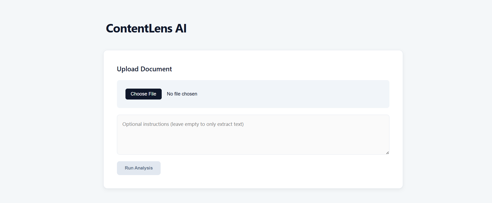

# ContentLens AI


**ContentLens** is an AI-powered marketing platform that intelligently extracts, analyzes, and summarizes insights from documents and content using a sophisticated multi-agent architecture. It leverages **LangGraph** and **LangChain** to orchestrate parallel agent workflows, **Langfuse** for comprehensive observability and performance tracking, and **Ollama** for locally-served LLMs, ensuring fast, secure, and scalable AI-powered content processing with **zero server costs**. The system includes a **FastAPI backend** to handle diverse file uploads (PDF, DOCX, TXT, images with OCR) and a **React-based TypeScript frontend** for intuitive document upload and real-time visualization of AI-generated insights.

**Optimized for cost-effective deployment:** Run backend/frontend on small AWS EC2 instances with Ollama inference engine on Google Colab (free GPU), connected via Ngrok. Total infrastructure cost: ~$10-20/month.


---

## 🎯 Key Achievements & Performance Metrics

**ContentLens** delivers enterprise-grade performance and reliability:

- **Data Extraction / Data Quality:** Overall quality is **~82.5%**, validated through both LLM judgment and rule-based human validation
- **Agent Performance:** Agents achieve an approximate **80% quality level** across all tasks
- **Latency Improvement:** Migrating from sequential execution to **parallel agent processing** improved **90th-percentile latency by ~70%**, even under stress testing
- **Concurrency Handling:** System handles multiple concurrent requests with **workflow rate limiter of 3** and **parallel agent execution of 6**, delivering results in **~3 minutes worst-case latency**
- **Infrastructure Cost:** **Zero server costs** — all LLM inference runs on Ollama servers (local or cloud)
- **Observability:** Complete tracing and performance monitoring via Langfuse with full access to spans, traces, and execution logs

---
## UI



---

## Demo

<video src="images/Demo.mp4" controls="controls" style="max-width: 100%;">
  Your browser does not support the video tag.
</video>

---

## 🔍 Project Purpose

ContentLens AI empowers marketing teams and content creators to transform raw documents into actionable insights at scale. Designed for:

- Extracting key information from marketing briefs, reports, and media assets with 82.5% quality
- Summarizing content and generating insights for campaigns using parallel agent execution
- Performing OCR on scanned marketing documents and images for text extraction
- Translating and analyzing documents across multiple languages to inform strategy and messaging
- Running intelligent, parallel multi-agent workflows orchestrated via LangGraph for optimal performance

---

## 🎯 Intended Use & Marketing Focus

**Important:** This multi-agent system is designed to help marketing teams rapidly prototype and build document-driven marketing materials, generate summaries and insights, and accelerate content development for authorized campaigns. It is suitable for content ideation, internal research, and marketing asset production when used responsibly.

Please follow these responsible marketing guidelines:
- **Consent & opt-in:** Only use content and data for marketing when you have explicit consent or a lawful basis; do not use the tool to send unsolicited messages or spam.
- **No targeted deception:** Avoid using outputs to manipulate, deceive, or covertly profile individuals for targeted persuasion.
- **Privacy & data minimization:** Do not upload sensitive PII or regulated data unless strictly necessary and properly secured.
- **Human review & QA:** Always review, edit, and fact-check generated content to ensure brand alignment and accuracy.
- **Compliance & transparency:** Adhere to applicable marketing regulations, platform policies, and transparently disclose AI-assisted content when required.

---

## ✨ Architecture & Technology Stack

### Core Orchestration & Observability
- **LangGraph:** Orchestrates parallel agent execution and workflow state management
- **LangChain:** Foundation for prompt templates, chains, and agent interactions
- **Langfuse:** Full-stack observability platform for tracing, logging spans, performance metrics, and agent execution analysis
- **Ollama:** Local/cloud LLM inference engine with zero server infrastructure costs

### Agent-Driven Workflow
- **9 specialized agents:**
  - **Extractor** — Extracts structured data from documents
  - **Analyzer** — Performs in-depth content analysis
  - **Summarizer** — Generates concise, actionable summaries
  - **Translator** — Multi-language translation and localization
  - **Compliance Checker** — Evaluates regulatory and compliance requirements
  - **Ideation** — Generates campaign concepts and creative ideas
  - **Copywriter** — Produces marketing copy and messaging
  - **Recommender** — Delivers prioritized, actionable recommendations
  - **Router** — Intelligently routes user requests to appropriate agents

### Failure Handling & Resilience
- **Automatic Fallback:** If Ollama fails, the system automatically falls back to **Cohere cloud API** for continued processing
- **Retry Logic:** Implements exponential backoff retry mechanism (up to 3 attempts) with intelligent error handling
- **Graceful Degradation:** Structured error responses and partial result handling ensure system stability

### Rate Limiting & Concurrency
- **Workflow Rate Limiter:** Maximum 3 concurrent workflow requests to manage resource utilization
- **Parallel Agent Execution:** Up to 6 agents execute in parallel within each workflow for sub-3-minute turnaround
- **GPU-Aware Concurrency:** Semaphore-based concurrency control optimizes GPU/CPU usage

---

## ✨ Features

- **REST API** — Multipart file uploads for documents and images with structured JSON responses
- **LangGraph-Powered Workflows** — Parallel agent orchestration with state management and error handling
- **OCR Support** — Tesseract-based OCR for scanned images and PDFs with automatic text extraction
- **Multi-LLM Support** — Configurable LLM settings via environment variables with Cohere fallback
- **Marketing Agents** — Ideation, copywriting, compliance checks, and recommendation engines for accelerated marketing workflows
- **End-to-End Observability** — Langfuse integration for real-time tracing, performance monitoring, and agent quality metrics
- **Data Validation** — Comprehensive input validation and output validation using rule-based and LLM-based checks
- **React TypeScript Frontend** — Modern, responsive UI with file uploader and real-time results visualization
- **Comprehensive Testing** — PyTest coverage with structured test data and CI/CD via GitHub Actions
- **GPU Acceleration** — Support for GPU-accelerated inference in Google Colab with Ngrok endpoint exposure for development

---

## 📊 Error Analysis & Continuous Improvement

The system includes an **error analysis notebook** (`error_analysis/ContentLens_AI_Performance_Analysis_Report.ipynb`) that:
- Loads Langfuse trace and observation exports using pandas
- Analyzes agent performance metrics and latency distributions
- Generates visualizations (histograms, heatmaps, trend charts) using matplotlib
- Calculates percentile latency improvements and identifies performance bottlenecks
- Provides data-driven insights for iterative agent refinement

**Example analyses include:**
- Latency distribution histograms and daily trends
- Agent-specific performance heatmaps
- P50/P90 latency trends and improvement tracking
- Quality score aggregations across agent types

---

## 🚀 Quick Start

### Prerequisites

- **Python 3.11+** (recommended)
- **Node.js 16+** / npm or Yarn for the frontend
- **Tesseract OCR** installed and accessible in PATH (for OCR features)
- **Ollama** or equivalent LLM runtime running locally (or accessible via OLLAMA_BASE_URL)
- **Optional:** Cohere API key for fallback LLM support
- **Optional:** Langfuse credentials for observability

### Backend Setup (Development)

1. Create and activate a Python virtual environment:

```bash
python -m venv .venv
# Windows
.venv\Scripts\activate
# macOS / Linux
source .venv/bin/activate
```

2. Install backend dependencies:

```bash
pip install -r backend/requirements.txt
```

3. Create a `.env` file in `backend/` (see Configuration section below):

```bash
cp backend/.env.example backend/.env
# Edit backend/.env with your settings
```

4. Run the backend with Uvicorn:

```bash
cd backend
uvicorn app.main:app --reload --port 8000
```

Open http://localhost:8000/ — you should see a JSON response confirming the backend is running.

### Frontend Setup (Development)

1. Install Node dependencies:

```bash
cd frontend
npm install
```

2. Start the development server:

```bash
npm start
```

Open the UI at http://localhost:3000 by default.

---

## 🧪 Running Tests

Backend tests are implemented under `backend/tests/` using **PyTest** with structured test data:

```bash
# From project root
pip install pytest
pytest backend/tests -v
```

Tests cover:
- API endpoints and request/response handling
- Agent execution and output validation
- Graph workflow orchestration
- OCR and file processing

---

## ⚙️ Configuration

Configuration is centralized in `backend/app/core/config.py` and can be overridden via a `.env` file in the backend folder.

### Key Settings

**Application & Environment:**
- `APP_NAME` — Application name (default: ContentLens_AI)
- `ENV` — Environment mode: `development` or `production`
- `LOG_LEVEL` — Logging verbosity (default: INFO)

**LLM & Inference:**
- `OLLAMA_BASE_URL` — URL for Ollama runtime (default: http://localhost:11434)
- `OLLAMA_MODEL_EXTRACTOR` — Model for data extraction (default: gemma2:9b-instruct-q5_0)
- `OLLAMA_MODEL_ROUTER` — Model for intent routing (default: gemma2:9b-instruct-q5_0)
- `OLLAMA_MODEL_SUMMARIZER` — Model for summarization (default: llama3.2:3b)
- `OLLAMA_MODEL_TRANSLATOR` — Model for translation (default: gemma2:9b-instruct-q5_0)
- `OLLAMA_MODEL_ANALYZER` — Model for analysis (default: llama3.2:3b)
- `OLLAMA_MODEL_RECOMMENDER` — Model for recommendations (default: llama3.2:3b)
- `OLLAMA_MODEL_IDEATION` — Model for campaign ideation (default: llama3.2:3b)
- `OLLAMA_MODEL_COPYWRITER` — Model for copywriting (default: gemma2:9b-instruct-q5_0)
- `OLLAMA_MODEL_JUDGE` — Model for quality judgment (default: llama3.2:3b)
- `OLLAMA_MODEL_REFINER` — Model for refinement (default: llama3.2:3b)

### Supported Models

**Current Production Models:**
- **llama3.2:3b** — Lightweight, fast reasoning model optimized for extraction, analysis, and judgment tasks
  - Tokens: 0 | Cost: **$0** (self-hosted via Ollama)
  - Best for: Deterministic tasks, recommendations, analysis, summarization
- **gemma2:9b-instruct-q5_0** — Instruction-tuned model optimized for extraction, routing, translation, and copywriting
  - Tokens: 0 | Cost: **$0** (self-hosted via Ollama)
  - Best for: Instruction following, complex reasoning, creative tasks

**Model Cost Analysis:** All models run on self-hosted Ollama servers (local or cloud), resulting in **zero per-token costs** compared to cloud providers.

**Temperature Settings (Creativity/Determinism):**
- `TEMPERATURE_EXTRACTOR` — 0.0 (deterministic)
- `TEMPERATURE_ROUTER` — 0.0 (deterministic)
- `TEMPERATURE_SUMMARIZER` — 0.3 (slightly creative)
- `TEMPERATURE_TRANSLATOR` — 0.0 (faithful translation)
- `TEMPERATURE_ANALYZER` — 0.2 (conservative)
- `TEMPERATURE_RECOMMENDER` — 0.3 (slightly creative)
- `TEMPERATURE_IDEATION` — 0.7 (highly creative)
- `TEMPERATURE_COPYWRITER` — 0.5 (moderately creative)
- `TEMPERATURE_JUDGE` — 0.0 (deterministic evaluation)
- `TEMPERATURE_REFINER` — 0.2 (conservative)

**Fallback LLM (Cohere Cloud):**
- `COHERE_API_KEY` — API key for Cohere cloud fallback
- `COHERE_MODEL` — Model identifier (default: command-a-03-2025)

**Observability (Langfuse):**
- `LANGFUSE_PUBLIC_KEY` — Langfuse public key (optional)
- `LANGFUSE_SECRET_KEY` — Langfuse secret key (optional)
- `LANGFUSE_BASE_URL` — Langfuse host (default: https://cloud.langfuse.com)

**File Processing:**
- `MAX_FILE_SIZE_MB` — Maximum upload size in MB (default: 20)
- `ALLOWED_EXTENSIONS` — Comma-separated file types (default: pdf,docx,txt,png,jpg,jpeg)

### Example `.env` File

```ini
APP_NAME=ContentLens_AI
ENV=development
LOG_LEVEL=INFO

# Ollama Configuration
OLLAMA_BASE_URL=http://localhost:11434

# Production Models (Zero-Cost, Self-Hosted)
OLLAMA_MODEL_EXTRACTOR=llama3.2:3b
OLLAMA_MODEL_ROUTER=gemma2:9b-instruct-q5_0
OLLAMA_MODEL_SUMMARIZER=llama3.2:3b
OLLAMA_MODEL_TRANSLATOR=gemma2:9b-instruct-q5_0
OLLAMA_MODEL_ANALYZER=llama3.2:3b
OLLAMA_MODEL_RECOMMENDER=llama3.2:3b
OLLAMA_MODEL_IDEATION=llama3.2:3b
OLLAMA_MODEL_COPYWRITER=gemma2:9b-instruct-q5_0
OLLAMA_MODEL_JUDGE=llama3.2:3b
OLLAMA_MODEL_REFINER=llama3.2:3b

# Temperature Settings (Adjusted for Model Capabilities)
TEMPERATURE_EXTRACTOR=0.0
TEMPERATURE_ROUTER=0.0
TEMPERATURE_SUMMARIZER=0.3
TEMPERATURE_TRANSLATOR=0.0
TEMPERATURE_ANALYZER=0.2
TEMPERATURE_RECOMMENDER=0.3
TEMPERATURE_IDEATION=0.7
TEMPERATURE_COPYWRITER=0.5
TEMPERATURE_JUDGE=0.0
TEMPERATURE_REFINER=0.2

# Cohere Fallback (Cloud Backup)
COHERE_API_KEY=your_cohere_api_key_here
COHERE_MODEL=command-a-03-2025

# Langfuse Observability (Optional)
LANGFUSE_PUBLIC_KEY=
LANGFUSE_SECRET_KEY=
LANGFUSE_BASE_URL=https://cloud.langfuse.com

# File Processing
MAX_FILE_SIZE_MB=20
ALLOWED_EXTENSIONS=pdf,docx,txt,png,jpg,jpeg
```

---

## 🔧 API Endpoints

Base route: `/api`

### Document Processing

- **POST** `/api/process-document` — Upload a file and process it through the intelligent workflow
  - **Parameters:**
    - `file` (multipart) — Document file (PDF, DOCX, TXT, or image)
    - `user_request` (form) — Intent/instruction (e.g., "Summarize and extract action items")
  - **Response:** Structured JSON with analysis, summary, extraction, recommendations, and metadata

**Example using curl:**

```bash
curl -X POST "http://localhost:8000/api/process-document" \
  -F "file=@/path/to/document.pdf" \
  -F "user_request=Summarize the main points and extract action items"
```

**Response Example:**

```json
{
  "summary": "...",
  "extraction": {...},
  "analysis": {...},
  "recommendations": [...]
}
```

---

## 📁 Project Structure

```
ContentLens_AI/
├── backend/                          # FastAPI backend application
│   ├── app/
│   │   ├── agents/                  # Multi-agent implementations (9 agents)
│   │   │   ├── analyzer.py          # Content analysis agent
│   │   │   ├── compliance.py        # Compliance checking agent
│   │   │   ├── copywriter.py        # Marketing copy generation
│   │   │   ├── extractor.py         # Data extraction agent
│   │   │   ├── ideation.py          # Campaign ideation agent
│   │   │   ├── judge.py             # Quality judgment agent
│   │   │   ├── recommender.py       # Recommendation engine
│   │   │   ├── refiner.py           # Output refinement agent
│   │   │   ├── router.py            # Intent routing agent
│   │   │   ├── summarizer.py        # Summarization agent
│   │   │   └── translator.py        # Translation agent
│   │   ├── api/                     # FastAPI routes and schemas
│   │   ├── core/                    # Configuration, logging, Langfuse, rate limiting
│   │   ├── graphs/                  # LangGraph workflow orchestration
│   │   ├── models/                  # Pydantic schemas and state definitions
│   │   ├── nodes/                   # LangGraph nodes (one per agent)
│   │   ├── tools/                   # File loaders, OCR, validators, language detection
│   │   ├── utils/                   # Utilities, exceptions, output validators
│   │   ├── workflows/               # Main workflow entry point
│   │   └── main.py                  # FastAPI application entry
│   ├── tests/                       # PyTest test suite
│   │   ├── test_agents.py           # Agent-level tests
│   │   ├── test_api.py              # API endpoint tests
│   │   ├── test_graph.py            # Workflow tests
│   │   └── test_data/               # Example test documents
│   ├── conftest.py                  # PyTest configuration
│   ├── requirements.txt             # Python dependencies
│   └── .env.example                 # Example environment configuration

├── frontend/                        # React TypeScript frontend
│   ├── src/
│   │   ├── components/              # Reusable React components
│   │   │   ├── FileUploader.tsx     # File upload interface
│   │   │   ├── ResultCard.tsx       # Results display
│   │   │   ├── Loader.tsx           # Loading indicator
│   │   │   └── ...
│   │   ├── pages/                   # Page components
│   │   │   ├── UploadPage.tsx       # Main upload interface
│   │   │   ├── ResultsPage.tsx      # Results display page
│   │   │   └── ...
│   │   ├── services/                # API integration
│   │   │   └── api.ts               # Backend API client
│   │   ├── styles/                  # CSS styling
│   │   ├── types/                   # TypeScript type definitions
│   │   └── ...
│   ├── package.json                 # Node.js dependencies
│   └── tsconfig.json                # TypeScript configuration

├── error_analysis/                  # Langfuse analysis notebook
	└── ContentLens_AI_Performance_Analysis_Report.ipynb                     # Performance analysis with pandas & matplotlib

├── images/                          # Project assets and branding
├── Makefile                         # Build and development commands
├── README.md                        # This file
└── .github/workflows/               # CI/CD pipeline (GitHub Actions)
```

---

## 📊 Workflow Architecture

The document processing workflow executes in parallel stages:

1. **File Loading & Validation**
   - Upload and parse documents (PDF, DOCX, TXT, images)
   - OCR for image-based content
   - Text sanitization and quality checks

2. **Intent Routing** (Router Agent)
   - Analyzes user request
   - Routes to appropriate agents (summarize, translate, analyze, recommend, ideate, copywrite, compliance)
   - Fallback to keyword-based routing for unclear requests

3. **Parallel Agent Execution** (Up to 6 agents in parallel)
   - **Extraction** — Structured data extraction
   - **Analysis** — In-depth content analysis
   - **Summarization** — Concise summaries
   - **Translation** — Multi-language support
   - **Ideation** — Campaign concept generation
   - **Copywriting** — Marketing copy production
   - **Compliance** — Regulatory requirement checking
   - **Recommendation** — Actionable insights

4. **Quality Judgment**
   - Judge Agent evaluates output quality
   - Scores range 0-1 across multiple dimensions
   - Results logged to Langfuse for analysis

5. **Response Aggregation**
   - Combine agent outputs into structured response
   - Apply output validation
   - Return to frontend with metadata and traces

---

## 🧭 Usage Examples

### Basic Document Analysis
Upload a marketing brief and request: "Extract key findings and provide recommendations"
- Backend runs extract, analyze, and recommend agents in parallel
- Returns structured insights

### Campaign Ideation
Upload competitor analysis and request: "Generate 5 campaign ideas for our product"
- Routes to ideation agent
- Generates creative campaign concepts with execution guidance

### Multi-Language Support
Upload document and request: "Translate summary to Arabic and generate campaign ideas"
- Runs translation and ideation agents in parallel
- Delivers localized, culturally adapted outputs

### Compliance Review
Upload marketing copy and request: "Check compliance with GDPR and privacy regulations"
- Runs compliance checking agent
- Returns compliance assessment with recommendations

---

## 🚀 Development & Deployment

### Architecture Overview

**Recommended Setup (Cost-Optimized for Small Deployments):**
```
┌─────────────────────────────────────────────────────┐
│ AWS EC2 (Small Instance: t3.small/t3.medium)        │
│ ├─ FastAPI Backend (Port 8000)                      │
│ └─ React Frontend (Port 3000)                       │
└──────────────────────┬──────────────────────────────┘
                       │ HTTP Request
                       ↓ OLLAMA_BASE_URL=https://ngrok-url
┌─────────────────────────────────────────────────────┐
│ Google Colab (GPU-Free Tier or Pro)                 │
│ └─ Ollama LLM Inference Server (Exposed via Ngrok)  │
└─────────────────────────────────────────────────────┘
```

### Google Colab (Ollama LLM Server Only)

Use Colab to run the Ollama inference engine with GPU acceleration, exposed via Ngrok:

1. Create a new Colab notebook
2. Install Ollama:
   ```bash
   !curl https://ollama.ai/install.sh | sh
   ```
3. Download models:
   ```bash
   !ollama pull llama3.2:3b
   !ollama pull gemma2:9b-instruct-q5_0
   ```
4. Start Ollama server:
   ```bash
   !ollama serve &
   ```
5. Install and expose via Ngrok:
   ```bash
   !pip install pyngrok
   from pyngrok import ngrok
   ngrok.set_auth_token("YOUR_NGROK_AUTH_TOKEN")
   public_url = ngrok.connect(11434)
   print(f"Ollama accessible at: {public_url}")
   ```
6. Keep the Colab notebook running (or use "Always keep running" in Pro)
7. Note the Ngrok URL for EC2 configuration

### AWS EC2 (Backend & Frontend Deployment)

Deploy the application on a small, cost-effective EC2 instance:

1. **Launch EC2 Instance:**
   - Instance Type: `t3.small` or `t3.medium` (sufficient for API & frontend)
   - OS: Ubuntu 22.04 LTS or Amazon Linux 2
   - Storage: 30GB EBS (gp3)
   - Security Group: Allow inbound traffic on ports 22 (SSH), 80 (HTTP), 443 (HTTPS), 3000 (frontend dev)

2. **SSH into instance:**
   ```bash
   ssh -i your-key.pem ec2-user@your-instance-ip
   ```

3. **Install dependencies:**
   ```bash
   sudo yum update -y  # or apt update (for Ubuntu)
   sudo yum install -y git python3.11 python3.11-pip nodejs npm
   pip install --upgrade pip
   ```

4. **Clone repository:**
   ```bash
   git clone https://github.com/Ziadashraf301/ContentLens_AI.git
   cd ContentLens_AI
   ```

5. **Configure Ollama remote URL:**
   ```bash
   cp backend/.env.example backend/.env
   
   # Edit .env with your Colab Ngrok URL
   # OLLAMA_BASE_URL=https://YOUR-NGROK-URL.ngrok.io
   ```

6. **Install and run backend:**
   ```bash
   cd backend
   pip install -r requirements.txt
   uvicorn app.main:app --host 0.0.0.0 --port 8000 &
   ```

7. **Install and run frontend:**
   ```bash
   cd ../frontend
   npm install
   npm run build
   npm install -g serve
   serve -s build -l 3000 &
   ```

### Configuration for Remote Ollama

**Example `.env` for EC2 pointing to Colab Ollama:**

```ini
APP_NAME=ContentLens_AI
ENV=production
LOG_LEVEL=INFO

# Remote Ollama (Colab + Ngrok)
OLLAMA_BASE_URL=https://YOUR-NGROK-URL.ngrok.io

# Models
OLLAMA_MODEL_EXTRACTOR=llama3.2:3b
OLLAMA_MODEL_ROUTER=gemma2:9b-instruct-q5_0
OLLAMA_MODEL_SUMMARIZER=llama3.2:3b
OLLAMA_MODEL_TRANSLATOR=gemma2:9b-instruct-q5_0
OLLAMA_MODEL_ANALYZER=llama3.2:3b

# Rest of config...
LANGFUSE_PUBLIC_KEY=your_key
LANGFUSE_SECRET_KEY=your_secret
```

### Cost Breakdown

| Component | Service | Estimated Cost |
|-----------|---------|-----------------|
| EC2 Instance | AWS t3.small | ~$7/month |
| EBS Storage | AWS (30GB gp3) | ~$2/month |
| Data Transfer | AWS | ~$1/month |
| Colab GPU | Google | Free (or $10/month Pro) |
| **Total** | | **~$10-20/month** |

**Zero LLM inference costs** — all models run on self-hosted Ollama (no cloud API fees).

### CI/CD Pipeline

The project uses **GitHub Actions** for automated testing and deployment:

- Triggers on push to main/feature branches
- Runs PyTest suite with coverage
- Validates code quality and dependencies

**Workflow file:** `.github/workflows/ci.yml`

---

## 💡 Performance Tuning

### Remote Ollama Optimization

When using remote Ollama (Colab + Ngrok), optimize for network latency:

- **Batch Requests:** Group multiple inference calls to reduce round-trips
- **Request Timeout:** Increase timeout in `backend/app/api/routes.py` (default: 30s, recommend 60s for remote)
- **Model Caching:** Keep frequently-used models in Ollama memory
- **Ngrok Upgrade:** Use paid Ngrok plan for better stability and bandwidth on production

### Rate Limiting

- Adjust `request_limit` in `backend/app/core/rate_limiter.py` to handle concurrent workflows
- For small EC2: Keep at 3 concurrent workflows or lower (depending on CPU/memory)
- Adjust `ollama_gpu_limit` based on Colab GPU availability

### Model Selection

- **gemma2:9b-instruct-q5_0** — Fast, low-latency for simple extraction and routing
- **llama3.2:3b** — Higher quality for complex copywriting and analysis
- Swap models at runtime via `.env` based on workload requirements

### EC2 Cost Optimization

- Use **t3.small** instance with CPU credits for variable workloads
- Use CloudWatch alarms to monitor instance utilization
- Consider **t4g.small** (Graviton) for better price/performance ratio

---

## 📝 Notes & Tips

- **LLM Runtime (Ollama on Colab):** 
  - Use free Google Colab or Colab Pro for GPU access
  - Keep Ngrok URL in `.env` as `OLLAMA_BASE_URL`
  - Colab notebooks can disconnect; use monitoring to detect downtime
  - Alternative: Run Ollama locally if using larger EC2 instance (g4dn.xlarge+)

- **EC2 Small Instance Tips:**
  - Monitor disk space: `df -h` (models can be 5-20GB)
  - Check memory usage: `free -h` (ensure 1GB+ free for backend)
  - Use `htop` for real-time resource monitoring
  - Reduce concurrent requests if hitting CPU limits
  - Consider t3.medium if t3.small hits resource limits

- **Network Troubleshooting (Remote Ollama):**
  - Test Colab connectivity: `curl -X GET https://YOUR-NGROK-URL.ngrok.io/api/tags`
  - Monitor Ngrok bandwidth: Use `ngrok` dashboard at https://dashboard.ngrok.com
  - Set connection timeout in backend: `httpx.AsyncClient(timeout=60.0)`

- **Observability:** Enable Langfuse integration for full tracing, performance analysis, and agent quality metrics. Create a free account at https://langfuse.com.

- **Error Analysis:** Use `error_analysis/ContentLens_AI_Performance_Analysis_Report.ipynb` to analyze Langfuse exports and identify performance bottlenecks.

- **Fallback Configuration:** Always configure `COHERE_API_KEY` and `COHERE_MODEL` for production deployments to ensure service continuity if Ollama becomes unavailable.

---

## � Roadmap & Future Work

ContentLens AI is under active development. Planned enhancements include:

### Near-Term (Q1-Q2 2026)

**Multi-Model Agent Architecture**
- Support dynamic model selection per agent based on task complexity and quality requirements
- Implement model fallback chains for improved resilience

**Enhanced Data Extraction & OCR**
- Improve OCR quality through advanced preprocessing (image enhancement, deskewing)
- Add table and form extraction capabilities using vision transformers

**New Workflow Patterns**
- Add batch document processing for bulk operations
- Implement multi-document context awareness (cross-document analysis)

### Mid-Term (Q2-Q3 2026)

**Conversational AI Features**
- Add **interactive chatbot with memory** for follow-up questions on processed documents
- Implement session-based conversation history with persistent context
- Enable real-time refinement and clarification of agent outputs
- Support multi-turn dialogue for collaborative document analysis

**RAG (Retrieval-Augmented Generation) Integration**
- Add vector database support (Pinecone, Weaviate, Milvus) for document embeddings
- Implement semantic search across uploaded documents
- Enable RAG-powered agents that reference source documents in responses
- Create knowledge base indexing for enterprise document libraries

**Performance & Throughput Improvements**
- Optimize latency to sub-3-second P90 for simple extraction tasks
- Implement streaming responses for long-form outputs (summaries, reports)

### Long-Term (Q3-Q4 2026+)

**Advanced Features**
- Fine-tuning framework for custom model adaptation on domain-specific data
- Multi-language workflow optimization with language-specific models
- Real-time collaboration features for team document analysis
- Export workflows to no-code platforms (Make, Zapier) for enterprise automation

**Scale & Enterprise**
- Kubernetes orchestration for elastic scaling
- Multi-tenancy support with isolated workspaces and billing
- Advanced audit logging and compliance reporting (GDPR, SOC 2)
- Enterprise authentication (SAML, OAuth2) and RBAC

**Research & Innovation**
- Proprietary small language models (SLM) trained on marketing documents
- Novel agent architectures for improved reasoning and planning
- Automated agent performance optimization using reinforcement learning

---

## �👤 Author / Contact

**Repository Owner:** Ziadashraf301 (GitHub)

For issues, questions, or contributions:
- Open an issue in the repository
- Contact via GitHub profile: https://github.com/Ziadashraf301

---

## 📄 License

This project is provided as-is for marketing and content acceleration workflows. Ensure compliance with applicable regulations and platform policies when deploying.# or

---
